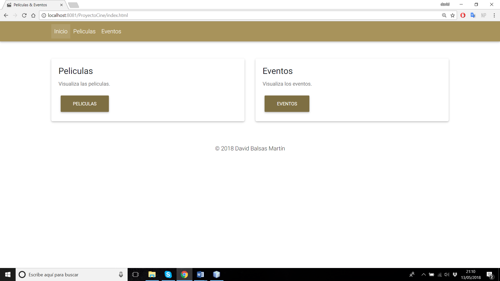
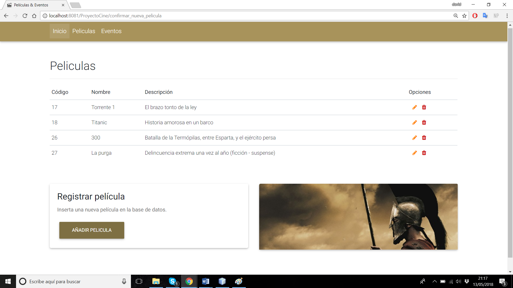
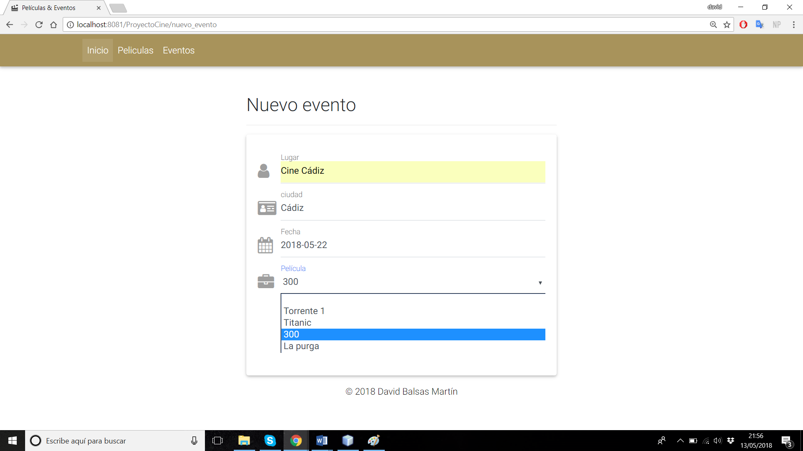
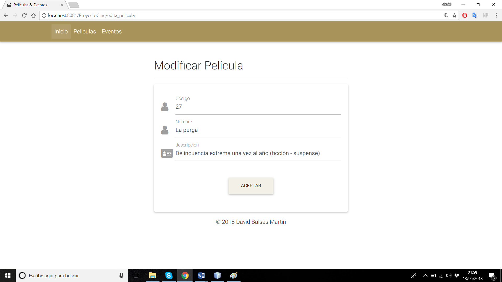
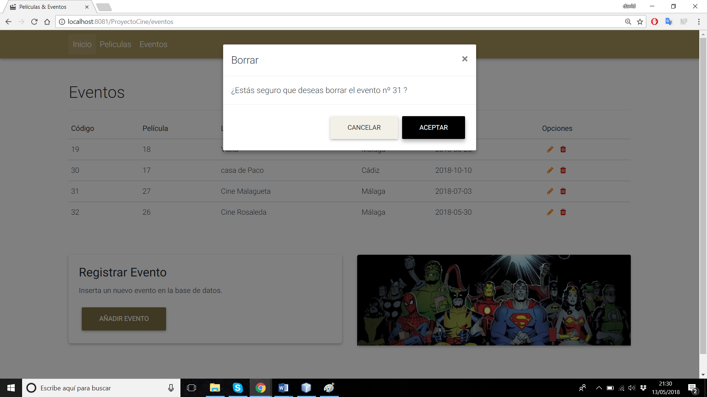
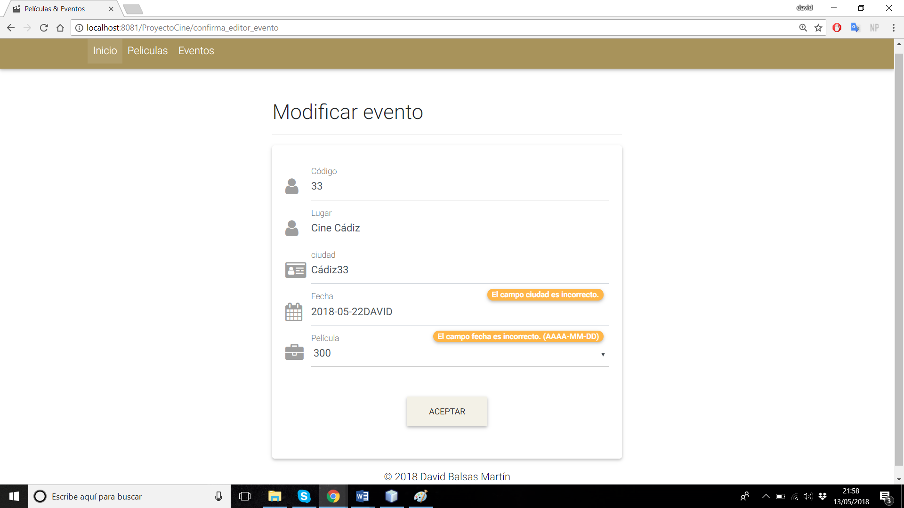
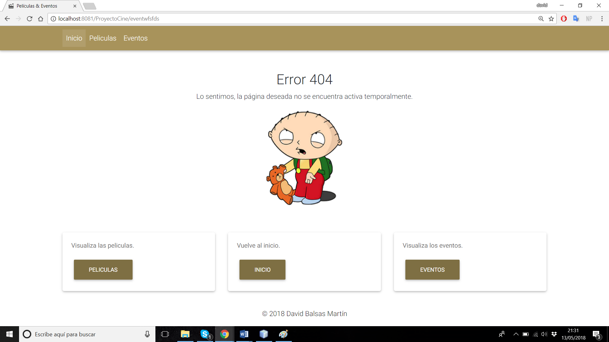

# CRUD-V2
Segunda versión del ejercicio crud película-evento, ahora con un cambio estético, y sobre todo funcional.
Han sido añadidos ArrayList, HashMap, javascript, servlets, patrón DAO, MDBootstrap,
validación desde servlet, página de error, gestionado por Maven, jstl, etc.

Los ArrayList y HashMap requeridos se han implementado ambos en casi todos los servlets.

Ejercicio CRUD en JSP, MySQL y bootstrap sobre gestión de unas películas en diferentes fechas puntuales y lugares.
A continuación, unas imágenes del crud y su realización:

## index.html

## Lista de películas

## Nuevo evento

## Modificar película

## Borrar evento

## Validaciones

## Error

